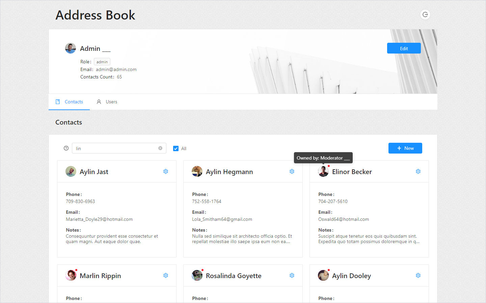

# Address Book Client

This is client part of Address Book project which allows you to manage contacts.

  

  &nbsp;&nbsp;&nbsp;
  &nbsp;&nbsp;&nbsp;
  &nbsp;&nbsp;&nbsp;
  

## Table of Contents

- [About](#about)
- [Usage](#usage)
- [Features](#features)
- [Technologies](#technologies)
- [Development](#development)

## About 

Web app with simple and clean design usable on desktop as well on mobile devices. Different roles give different access privileges with frontend guards (disabled/hidden elements) as well with backend guards (error messages). For more info about the api, check out [server part](https://github.com/mmustra/address-book-server) built with NestJS and MongoDB.

## Usage 

Access application either by "Quick login" or by registerting. If you choose to register, you will be assigned wih lowest role (User) by default. Once you log in you can edit your profile, manage your contacts and depending on the role have ability to see or edit other contacts and users. Role permissions info are available under info icons at "Quick login" dropdown.

| Roles     | User Actions           | Contact Actions        |
| --------- | ---------------------- | ---------------------- |
| Admin     | RUD `any` / RU\* `own` | RUD `any` / CRUD `own` |
| Moderator | R `any*` / RU\* `own`  | RU `any*` / CRUD `own` |
| User      | - `any` / RU\* `own`   | - `any` / CRUD`own`    |

any\* - except Admin  
U\* - except "Quick login" users

## Features 

- Lazy loaded modules
- Guarded routes
- State manager, cached page changes
- Role based permissions
- Request and response error interceptors
- Reactive forms, dynamic controls, validations
- Custom components
- Login redirects
- Responsive design

## Technologies 

- Angular 8
- Ant Design (ng-zorro)
- NGXS, immer
- ngx-permissions
- RxJS, lodash, random-material-color...

## Development 

Run `ng serve` for a dev server. Navigate to `http://localhost:4200/`. The app will automatically reload if you change any of the source files.

#### Requirements

- Node [v10.16.3](https://nodejs.org/download/release/v12.13.0/), Npm v6.9.0, (you can use [nvm](https://github.com/nvm-sh/nvm) or [nvm-windows](https://github.com/coreybutler/nvm-windows))
- Angular Cli [v8.3.5](https://www.npmjs.com/package/@angular/cli/v/8.3.5)

#### IDE

[Visual Studio Code](https://code.visualstudio.com/) is recommended. [Prettier](https://prettier.io/) is used as formater for the project.

#### Web Browser

Use Redux DevTools addon (available for Chrome and Firefox) for debugging state container.

#### Code style

Be sure to follow current folder structure and code style in the project. Use Typescript to create better code environment with your contributions. Before adding new packages to project be sure to first check `package.json` for possible duplicates.

For generating new angular components use `ng generate`.  
Example: `ng generate component component-name`

You can also use `ng generate directive|pipe|service|class|guard|interface|enum|module`. To get more help on the Angular CLI use `ng help` or go check out the [Angular CLI README](https://github.com/angular/angular-cli/blob/master/README.md).

#### Scripts

##### Serve

Run `ng serve` to serve the project. Use the `--prod` flag for a production build.

##### Build

Run `ng build` to build the project. The build artifacts will be stored in the `dist/` directory. Use the `--prod` flag for a production build.

##### Running unit tests

Run `ng test` to execute the unit tests via [Karma](https://karma-runner.github.io).

##### Running end-to-end tests

Run `ng e2e` to execute the end-to-end tests via [Protractor](http://www.protractortest.org/).

## License

The MIT License ([MIT](./LICENSE))  
Copyright (c) 2020-present, Marin Muštra
